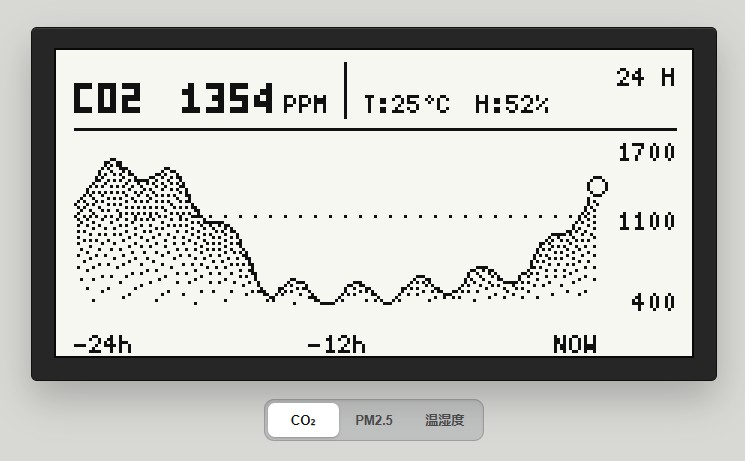

# u8g2-js

🌐 **English** · [中文](./README.zh-CN.md)

A **pure-JavaScript port** of the [U8G2](https://github.com/olikraus/u8g2) monochrome graphics
library for the browser / Node, with **pixel-perfect, byte-identical rendering** to the real
hardware. Built for AI-generated code + in-browser simulation before embedded device development.

- **Zero-build, zero-dependency**: native ES modules, works directly from `file://` in the
  browser and from Node.
- **Pixel-perfect**: framebuffer layout, `draw_color` 0/1/2, font RLE bitstream decoding,
  `draw_l90` rotation transforms, Bresenham primitives — all ported 1:1 from the C source and
  **cross-validated byte-for-byte against the real C library** (see [Verification](#verification)).
- **Fonts load at runtime**: a font is just a `Uint8Array` byte stream; load your own with JS at
  runtime. Any U8G2 font works, including Chinese fonts generated with `bdfconv`.
- **API-compatible**: Arduino `U8g2lib`-style camelCase as the primary API, plus C-style
  snake_case / `u8g2_*` aliases so code moves to real hardware unchanged.

## Live demo

A 212×102 monochrome e-paper sensor dashboard (CO₂ / PM2.5 / temperature-humidity trends) built
on u8g2-js — a pixel-faithful browser simulation of a real e-paper panel:



**Live demo:** [createskyblue.github.io/epaper-sensor-trend-demo](https://createskyblue.github.io/epaper-sensor-trend-demo/) · **Source:** [github.com/createskyblue/epaper-sensor-trend-demo](https://github.com/createskyblue/epaper-sensor-trend-demo)

The demo pulls `u8g2-js` in as a git submodule, so it runs the exact same rendering engine
that would run on the device.

## Upstream base commit

This port is validated against the following **U8G2 upstream master** commit:

```
commit ab9e48b2228351e9476682a70b7f3ee4909cd585
Date:   2026-06-27 16:10:31 +0200
Subject: Merge pull request #2786 from iggymayer/fix-flipmode-ssd1362z-OEL1M0033WE
```

The original C library is shallow-cloned (this commit only) into the sibling `u8g2/` directory,
and `tools/cverify/build.sh` runs the **byte-for-byte cross-validation against exactly this
version** of the C library. To upgrade the base: re-`git clone https://github.com/olikraus/u8g2.git`
to latest master and re-run `bash tools/cverify/build.sh` to confirm consistency.

## Quick start

```js
// Browser: <script type="module">
import { U8g2, U8g2Font } from './u8g2-js/src/index.js';

// create an SSD1306 128x64 display
const u8g2 = new U8g2({ display: 'ssd1306_128x64_noname_f' });

// load a font at runtime (a font is just a byte array)
const font = await U8g2Font.load('./u8g2-js/fonts/u8g2_font_5x7_tf.bin');
u8g2.setFont(font);

// draw — same calls as Arduino
u8g2.clearBuffer();
u8g2.drawStr(0, 10, 'Hello');
u8g2.drawBox(0, 20, 10, 5);
u8g2.drawCircle(60, 30, 8, 15);
u8g2.sendBuffer();

// attach a <canvas>
u8g2.attachCanvas(document.getElementById('screen'));
```

Node works too (headless PBM / raw buffer export, great for tests):

```js
import { U8g2, U8g2Font, toPBM } from './u8g2-js/src/index.js';
const u8g2 = new U8g2({ display: 'ssd1306_128x64_noname_f' });
u8g2.setFont(await U8g2Font.load('fonts/u8g2_font_5x7_tf.bin'));
u8g2.drawStr(0, 10, 'Hello');
console.log(toPBM(u8g2));   // P4 PBM text
```

## Demo

The demos are ES modules and load fonts on demand, so they need a **live HTTP server** — run one
**from the project root**, then open the page in your browser:

```bash
# from the project root, any of these work:
npx serve .                # then open http://localhost:3000/demo/demo.html
python -m http.server      # then open http://localhost:8000/demo/demo.html
# or in VS Code: right-click demo/demo.html -> "Open with Live Server"
```

Start from the **root [`index.html`](./index.html)** — a navigation hub for all three demos:

- **`demo/demo.html`** — the interactive simulator: pick a display, rotation, zoom, pixel grid,
  write U8G2 code, animate, and **load any font at runtime** (dropdown / `.bin` file / paste
  base64). The default sketch is a **Chinese dashboard** (temperature / humidity / status)
  demonstrating the bundled full Chinese fonts.
- **`demo/chinese-fonts/index.html`** — the **Chinese font family comparison** page: one 720×720
  virtual screen (pixel 1:1, no scaling) per family, switched with the ← → arrow keys or the tabs.
  Fonts **load on demand** when you switch families — 18 families (SimSun at all six sizes, every
  MapleMono-NF-CN weight, SimHei / YaHei / KaiTi / FangSong / Noto Sans SC / DengXian at 12/16/24 px).
- **`demo/siji-icons/index.html`** — the **Siji icon library** browser: u8g2 icon fonts
  ([Siji](https://github.com/stark/siji) PUA icons + the open_iconic series) rendered in a grid.
- **`demo/bomberman/index.html`** — **Bomberman**, the Arduboy2 game
  ([Bomberman.ino](https://github.com/createskyblue/Bomberman) by LHW-HWT, CC BY-NC-SA) ported to
  u8g2-js: 128×64 pixel game, arrow keys move, place bombs to destroy the walls and monsters.

There is **no pre-built `-standalone` single-file HTML** — it was dropped to keep the repo small.
Headless smoke checks: `node tools/check-demo.js` and `node tools/check-chinese-fonts.js`.

## Bundled full Chinese fonts

The demo ships **`chinese_full_8` / `chinese_full_10` / `chinese_full_12` / `chinese_full_16` /
`chinese_full_24` / `chinese_full_32`** — six full Chinese fonts (source: **SimSun 宋体**
`C:\Windows\Fonts\simsun.ttc`) covering:

- **all of CJK Unified Ideographs U+4E00–U+9FFF** (20902 chars, incl. rare ones) + CJK Ext A U+3400–4DBF
- full ASCII 0x20–0x7E + Latin-1 (° ± × ÷ · …)
- CJK punctuation, symbols like ℃ ℉, fullwidth forms, CJK compatibility forms

~**28,000 glyphs** in total, so any Chinese text you or an AI writes will render in the simulator.

**Vertical alignment**: generated with bdfconv **common-height mode `-b 1`**, so every glyph
shares one em box (12px→15 / 16px→18 / 24px→26 tall; consistent line height and multi-line
alignment). With **SimSun**, CJK glyphs sit uniformly on the baseline (bottoms aligned, tops
consistent) — no more "floating" like MapleMono, where e.g. 度 poked 2px below the baseline.
Within each glyph, ink extent still varies naturally (e.g. 一 is a short stroke in the lower-mid
box) — that's normal bitmap-font behavior, identical to official U8G2 CJK fonts. The map also
**excludes U+3031/3032 (〱〲 vertical repetition marks)** whose 30px bounding boxes would inflate
the common height / line height.

Alternatives: `NotoSansSC-VF.ttf` (OFL open-source, but the VF default weight is thin),
`MapleMono` (originally used; CJK baselines were misaligned). Change `FONT` in `gen_full.py` to
switch sources.

These fonts are generated by `tools/fontgen/gen_full.py`:

```bash
python tools/fontgen/gen_full.py    # uses Python_u8g2_Fonts_Tools' otf2bdf + bdfconv
node tools/convert-fonts.js tools/fontgen/out/cn16/code/chinese_full.c -o fonts --format bin,js
```

> ⚠️ bdfconv note: the font tool's **old bundled bdfconv.exe** (per-entry=100) asserted on
> ~20k Unicode glyphs; its `bdfconv.exe` was replaced with a build of the **current
> olikraus/u8g2 source** (per-entry=101, no such issue). Results verified byte-for-byte against
> the original C library.

The font generator (otf2bdf + bdfconv + Chinese extraction; this project's fonts are made with it):
[Easy-u8g2-font-generate-tools](https://github.com/createskyblue/Easy-u8g2-font-generate-tools)

## Fonts: runtime loading

A font is the exact byte stream the device uses (U8G2 "new font format"). Four ways to load one:

```js
// 1) base64 from the converter
U8g2Font.fromBase64("AP//AA...")

// 2) paste the C string from a generated .c file (octal escapes)
U8g2Font.fromC("\\277\\0\\2\\2\\3\\3...")

// 3) it's just an array
U8g2Font.fromArray(new Uint8Array([...]))

// 4) remote / local file
await U8g2Font.load("/fonts/u8g2_font_5x7_tf.bin")   // browser fetch / Node file read
```

Register one by name, then `setFont(name)`:

```js
U8g2Font.register('my_font', fontData);   // U8g2Font / Uint8Array / base64 all accepted
u8g2.setFont('my_font');
```

`setFont()` also accepts a `U8g2Font` instance, a `Uint8Array` or a base64 string directly.

### Convert your own fonts

Any U8G2 font `.c` file converts (including **Chinese fonts from bdfconv**, same format):

```bash
# single: fonts/u8g2_font_5x7_tf.c -> .bin (recommended for fetch/file read)
node tools/convert-fonts.js ../u8g2/tools/font/build/single_font_files/u8g2_font_5x7_tf.c \
  -o fonts --format bin

# output .js (base64 module, import-ready) or .json
node tools/convert-fonts.js .../u8g2_font_myfont.c -o myfonts --format js

# batch-convert a whole directory
node tools/convert-fonts.js --batch .../single_font_files -o myfonts --format bin
```

`fonts/` ships 9 classic example fonts + the 6 full Chinese fonts (each as `.bin` and `.js`).

### Official font pack — all 2174 U8G2 fonts, precompiled

The **entire official U8G2 font collection** is precompiled as import-ready JS modules under
`fonts/` — one file per font (`u8g2_font_5x7_tf.js`, `u8x8_font_8x16_1x2_f.js`, …). The bytes
are taken **verbatim from the C arrays**, so each is byte-for-byte identical to the font compiled
onto a real device (verified against `gcc`-compiled reference arrays, plus every font's length is
checked against the size declared in its `.c` header).

```js
import b64 from 'u8g2-js/fonts/u8g2_font_10x20_tf.js';

const font = U8g2Font.fromBase64(b64);            // -> U8g2Font
U8g2Font.register('u8g2_font_10x20_tf', font);    // then setFont('u8g2_font_10x20_tf')
```

Or keep them out of the bundle and import on demand — every module is a small self-contained
ESM that just exports its base64 string.

`fonts/index.json` is a lightweight manifest of all 2174 fonts:
`{ name, file, size, glyphs }` — handy for building a font picker (e.g. a `<select>` for the
simulator) without importing the font data itself.

Reproduce / refresh the pack from the upstream C sources:

```bash
node tools/convert-all-fonts.js            # reads ../u8g2/tools/font/build/single_font_files
                                           # writes fonts/*.js + fonts/index.json
```

## Displays

`setup.js` registers ~30 common panels (parameters from the `u8x8_d_*.c` display_info structs):

| Controller | Models |
|---|---|
| SSD1306 | 128x64 / 128x32 / 96x16 / 64x32 / 72x40 |
| SH1106 | 128x64 / 72x40 / 64x32 |
| SSD1305 / 1309 / 1315 / 1316 / 1325 | 128x32 / 128x64 / 128x128 / 96x32 … |
| ST7920 (horizontal byte layout) | 128x64 / 256x32 / 144x32 / 160x32 / 192x32 |
| UC1701 / ST7565 | 102x64 / 128x64 / 132x32 |
| E-paper | SSD1606 172x72 / SSD1607 200x200 / IL3820 296x128 |

Any custom size works (e.g. the **250×122 IL3829**, which isn't in the tree):

```js
new U8g2({ width: 250, height: 122, layout: 'vertical', xOffset: 0 });
```

`listPresets()` returns all preset names.

## API

The main API matches the Arduino `U8g2` class (`drawStr` / `setFont` / `sendBuffer` …), with
C-style aliases (`u8g2_draw_str` / `u8g2_DrawStr` / `draw_str`) so code ports to real hardware.

**Lifecycle / page buffer**: `begin` `clearBuffer` `sendBuffer` `firstPage` `nextPage`
`clearDisplay` `clear` `setAutoPageClear` `getBufferPtr/Size/TileWidth/TileHeight`
`updateDisplay` `updateDisplayArea`

**Color**: `setDrawColor`(0/1/2) `getDrawColor` `setBitmapMode`

**Primitives**: `drawPixel` `drawLine` `drawHLine` `drawVLine` `drawHVLine` `drawBox`
`drawFrame` `drawRBox` `drawRFrame` `drawCircle` `drawDisc` `drawEllipse` `drawFilledEllipse`
`drawArc` `drawTriangle` `clearPolygonXY/addPolygonXY/drawPolygon` `drawXBM` `drawXBMP`
`drawBitmap`

**Text / font**: `setFont` `setFontMode` `setFontDirection` `setFontPosBaseline|Top|Bottom|Center`
`setFontRefHeightText|ExtendedText|All` `drawStr` `drawStrX2` `drawUTF8` `drawUTF8X2`
`drawGlyph` `drawGlyphX2` `drawExtendedUTF8` `drawExtUTF8`(kerning) `drawHB`
`getStrWidth` `getUTF8Width` `getGlyphWidth` `getXOffsetGlyph|UTF8` `getStrX`
`isGlyph` `isAllValidUTF8` `getAscent` `getDescent` `getMaxCharWidth|Height` `getFontBBX*`

**Clipping / windows**: `setClipWindow` `setMaxClipWindow` `isIntersection` `getClipWindow`

**Misc**: `setDisplayRotation`(R0-R3) `setFlipMode` `setContrast` `setPowerSave`
`drawButtonFrame` `drawButtonUTF8` `setCursor` `home` `print` `println` `sleepOn|Off`
`getDisplayWidth|Height` `getWidth|Height`

**Deliberately not ported**: `drawLinePattern/Gradient` (removed in this U8G2 version),
the u8x8 low-level I2C/SPI protocol bytes (not needed for browser simulation), 8x8 text
displays, `drawLog/U8G2LOG`.

## Directory layout

```
u8g2-js/
  src/
    u8g2.js           # U8g2 main class: lifecycle / page buffer / text / clipping / rotation
    draw.js           # primitives: box/line/circle/ellipse/arc/triangle/xbm/button
    hvline.js         # low-level pixel writes (vertical_top_lsb / horizontal_right_lsb)
    font.js           # U8g2Font: header parse / glyph lookup / RLE bitstream decode
    utf8.js           # UTF-8 decoder (u8x8_utf8_next port)
    setup.js          # display presets + custom displays
    renderer/         # canvas.js (browser) + pbm.js (headless export)
    index.js          # unified entry point
  demo/               # interactive simulator (demo.html) + chinese-fonts/ comparison page
  fonts/              # official font pack: 2174 precompiled JS modules + index.json
  tools/
    convert-fonts.js  # .c font -> .bin/.js/.json (incl. batch, default both)
    convert-all-fonts.js # .c font pack -> fonts/*.js + fonts/index.json
    check-demo.js     # demo boot self-check (imports demo.js in Node)
    check-chinese-fonts.js # chinese-fonts page boot self-check
    fontgen/          # full-CJK font generation (gen_full.py + gen_families.sh)
    cverify/          # byte-for-byte cross-validation against the real C library
  test/test.js        # Node headless test suite (30 tests)
```

## Verification

1. **Byte-for-byte cross-validation against the real C library** (`tools/cverify/build.sh`,
   requires gcc): compiles the real U8G2 C library, renders 18 scenarios/checks
   (text / shapes / rotation / clipping / XOR / buttons / Unicode / **full Chinese font** /
   font-data identity) and diffs the framebuffer against the JS port — **all identical**.
2. **Node headless tests**: `node --test`, all 30 pass.
3. **Demo self-check**: `node tools/check-demo.js`.

## License

BSD-2-Clause. This is a JS port of U8G2 (including converted font data); the original
copyright notice is preserved.

Reference: the original C library is cloned into the sibling `u8g2/` directory.
