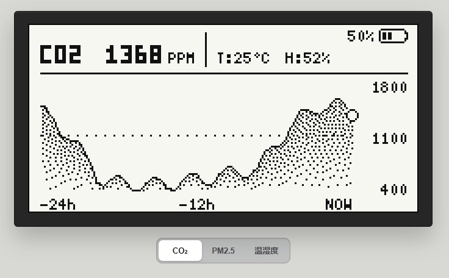
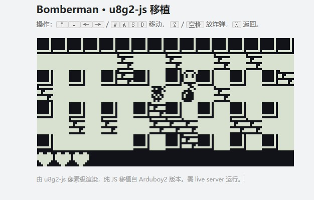

# u8g2-js

🌐 **English** · [中文](./README.zh-CN.md)

**U8G2, ported to pure JavaScript** — browser-based, pixel-faithful simulation for monochrome display development, so AI can verify the UI before it ships to hardware.



## U8G2: the standard for monochrome displays

OLED, monochrome dot-matrix LCD (the classic gray 12864 panels) and e-paper screens are too resource-constrained for heavyweight GUI frameworks like LVGL — the de-facto choice is **U8G2**: dozens of display controllers, a large font library, and a tiny memory footprint. If your product drives a monochrome display, you are almost certainly on U8G2.

## The problem

Developing on U8G2 is slow. Every display tweak means recompile → flash → look at the panel — tens of seconds to minutes per cycle. AI-written U8G2 code often *compiles but the screen is wrong*: font size, coordinates, layout off.

## This project: u8g2-js

We ported U8G2 to pure JavaScript and simulate the panel **pixel-for-pixel in the browser**. An AI assistant (Codex, Claude…) closes the whole loop in the browser:

1. **Develop** the U8G2 UI in JavaScript (runs in the browser unchanged)
2. **Verify visually** — screenshot it and inspect the pixels with multimodal vision
3. **User approves** once the effect is right
4. **Deploy** the same code to the device (API identical to the original U8G2 C library)

Display logic is validated early, in the browser — not after flashing hardware.

**Repo:** [github.com/createskyblue/u8g2-js](https://github.com/createskyblue/u8g2-js)

**Live demo:** [createskyblue.github.io/u8g2-js](https://createskyblue.github.io/u8g2-js/)

## Why the same code works on the device

- **Pixel-faithful** — the same official demo is run twice: once compiled with gcc from the C library, once in our JS port; both export the screen pixels, and **comparing the two images pixel-by-pixel gives 0 differences**. Framebuffer, fonts, `draw_color`, rotation — what the browser shows is what the device will show
- **Fonts are byte arrays** — load any U8G2 font at runtime; full Chinese fonts bundled (SimSun 8/10/12/16/24/32 px)
- **Zero-dependency ESM** — runs in the browser and Node
- Full games run too, e.g. **Bomberman**, with the same 128×64 rendering as the device:



## Quick start

```js
import { U8g2, U8g2Font } from './src/index.js';

const u8g2 = new U8g2({ display: 'ssd1306_128x64_noname_f' });
u8g2.setFont(U8g2Font.fromBase64('AP//AA...')); // a font is just a byte array
u8g2.drawStr(0, 10, 'Hello');
u8g2.sendBuffer();
u8g2.attachCanvas(document.getElementById('screen'));
```

Run a live server from the repo root (`npx serve .`) → open `index.html` for the demos.

## License

BSD-2-Clause, original U8G2 copyright retained.
